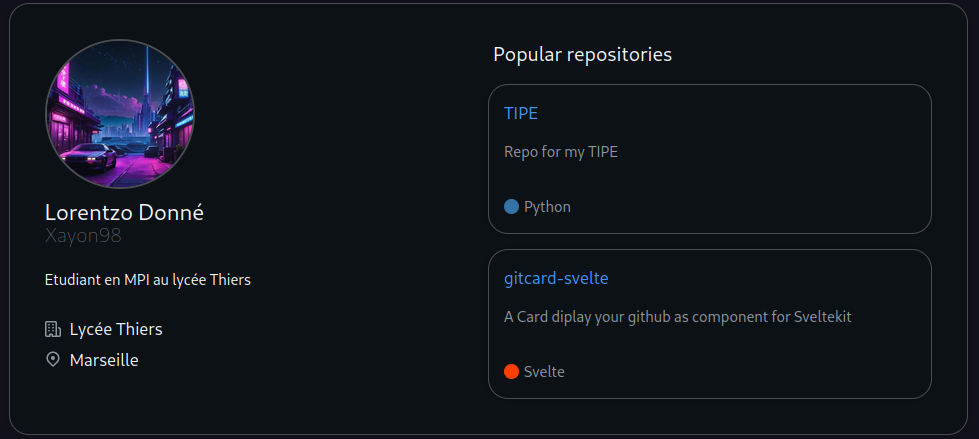

# gitcard-svelte
A Card diplay your github as component for Sveltekit

The repo is formatted as a sveltekit-like project. You just need to import the gitcard into you pages to use it and enter your GitHub API credentiel in the `.env`.
Warning : don't push you .env on your GitHub or anywhere else to avoid fiving your credential.

This is what it looks like 

Feel free to contact me if you have any problem !

## License
This project is under the MIT license. See [LICENSE](https://github.com/Xayon98/TIPE/LICENCE) for more information.
